# Production Web App with CI/CD on Azure VM + Azure DNS + HTTPS
## Azure VM (IaaS) + GitHub Actions + Custom Domain + SSL

---

# Project Overview

This project demonstrates how to deploy a production-ready Node.js application on a Microsoft Azure Virtual Machine using:

- Azure Virtual Machines (IaaS)
- Azure CLI
- GitHub Actions
- Azure DNS
- Nginx Reverse Proxy
- PM2 Process Manager
- HTTPS with Certbot

The project implements:

- Automated CI/CD deployment
- Custom domain integration
- HTTPS security
- Reverse proxy architecture
- Infrastructure automation

---

# Real-World Scenario

You’ve been hired as a DevOps Engineer at TechieHub.

The company already has a Node.js application, but:

- Deployments are manual
- No CI/CD exists
- No HTTPS security
- No custom domain
- Downtime occurs during updates

Your task is to modernize the infrastructure using Azure Virtual Machines and DevOps automation.

---

# Architecture Overview

```text
Developer
    ↓
GitHub Repository
    ↓
GitHub Actions CI/CD
    ↓
Azure Virtual Machine (Ubuntu Linux)
    ↓
PM2 Process Manager
    ↓
Nginx Reverse Proxy
    ↓
Azure DNS
    ↓
www.auemeribetech.com.ng (HTTPS)
    ↓
End Users
```


# Project Structure

node-app/
├── .github/
│   └── workflows/
│       └── deploy.yml
├── docs/
│   ├── architecture-diagram.dot
│   ├── architecture-diagram.png
│   └── architecture-diagram.svg
├── screenshots/
│   ├── azure-vm.png
│   ├── github-actions.png
│   └── https-success.png
├── .gitignore
├── index.js
├── package.json
├── package-lock.json
└── README.md
---

# PHASE 0 — CREATE ARCHITECTURE DIAGRAM

# Generate Architecture Diagram

## Step 1 - Install Graphviz locally using Homebrew:

```bash
/bin/bash -c "$(curl -fsSL https://raw.githubusercontent.com/Homebrew/install/HEAD/install.sh)"

brew install graphviz
```
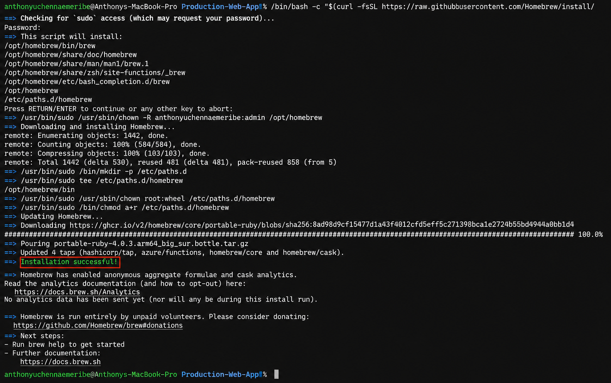


## Step 2 - Verify installation

```bash
dot -V
```


## Step 3 - Create diagram source

```bash
nano docs/architecture-diagram.dot
```

Paste:

```dot
digraph Azure_VM_CICD {
    rankdir=TB;
    fontname="Arial";

    node [
        shape=box,
        style=filled,
        fontname="Arial"
    ];

    developer [
        label="Developer\n(Code Changes)",
        shape=ellipse,
        fillcolor="lightgreen"
    ];

    github [
        label="GitHub Repository\n(Node.js Source Code)",
        fillcolor="lightblue"
    ];

    actions [
        label="GitHub Actions\n(CI/CD Pipeline)",
        fillcolor="lightblue"
    ];

    vm [
        label="Azure Virtual Machine\n(Ubuntu Linux)",
        fillcolor="orange"
    ];

    pm2 [
        label="PM2 Process Manager",
        fillcolor="lightyellow"
    ];

    nginx [
        label="Nginx Reverse Proxy",
        fillcolor="lightyellow"
    ];

    dns [
        label="Azure DNS Zone\nauemeribetech.com.ng",
        fillcolor="lightcyan"
    ];

    domain [
        label="Custom Domain\nwww.auemeribetech.com.ng\nHTTPS Enabled",
        fillcolor="lightcyan"
    ];

    users [
        label="End Users",
        shape=ellipse,
        fillcolor="lightgreen"
    ];

    developer -> github;
    github -> actions;
    actions -> vm;
    vm -> pm2;
    pm2 -> nginx;
    nginx -> dns;
    dns -> domain;
    domain -> users;

    subgraph cluster_azure {
        label="Microsoft Azure";
        style=dashed;

        vm;
        dns;
    }

    subgraph cluster_github {
        label="GitHub CI/CD";
        style=dashed;

        github;
        actions;
    }
}

![Diagram Source Codes](screenshots/diagram-source-codes.png)

## Step 4 - Generate PNG:
```bash
dot -Tpng architecture-diagram.dot -o architecture-diagram.png
```

## Step 5 - Generate SVG:

```bash
dot -Tsvg architecture-diagram.dot -o architecture-diagram.svg
```
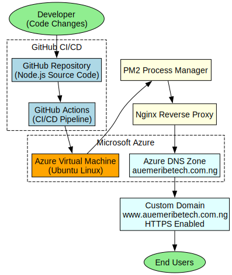
---

# PHASE 1 — CREATE NODE.JS APPLICATION

---

## Step 1 — Create Project Folder

```bash
mkdir node-app
cd node-app
```
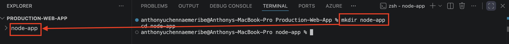

---

## Step 2 — Initialize Node.js Application

```bash
npm init -y
```
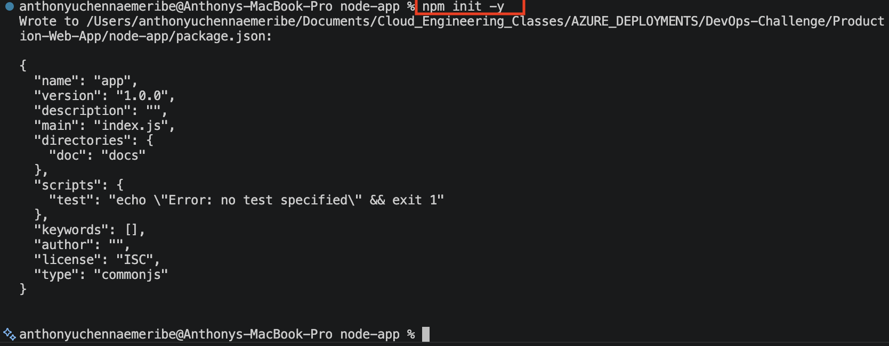
---

## Step 3 — Install Express.js

```bash
npm install express
```
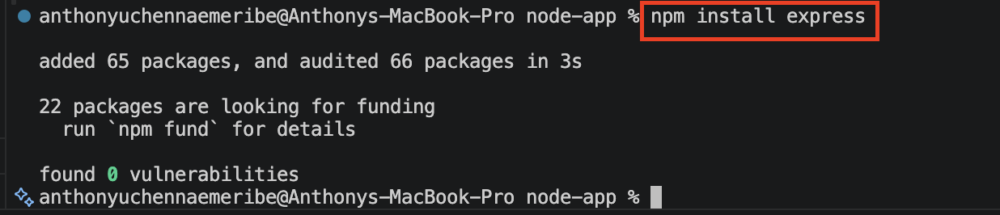
---

## Step 4 — Create index.js

```bash
nano index.js
```

Add:

```javascript
const express = require('express');
const app = express();

const PORT = process.env.PORT || 3000;

app.get('/', (req, res) => {
  res.send('Production DevOps App is Running!');
});

app.get('/health', (req, res) => {
  res.json({ status: 'OK' });
});

app.listen(PORT, () => {
  console.log(`Server running on port ${PORT}`);
});
```
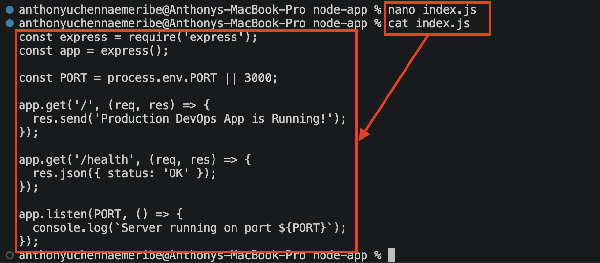
---

## Step 5 — Update package.json

1. Access the package.json using:
nano package.json

2. Update scripts section using the text editor:

```json
"scripts": {
  "start": "node index.js"
}
```
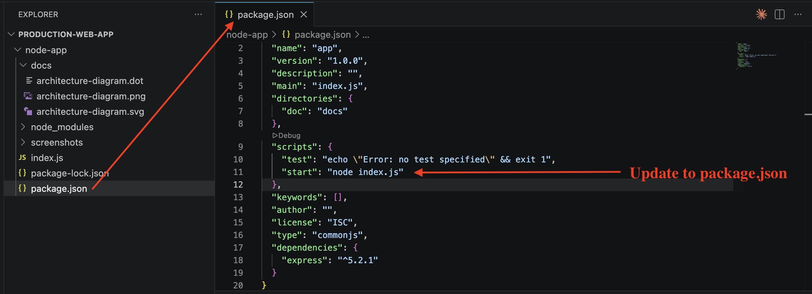
---

## Step 6 — Test Application Locally

```bash
npm start
```

Visit:

```text
http://localhost:3000
```
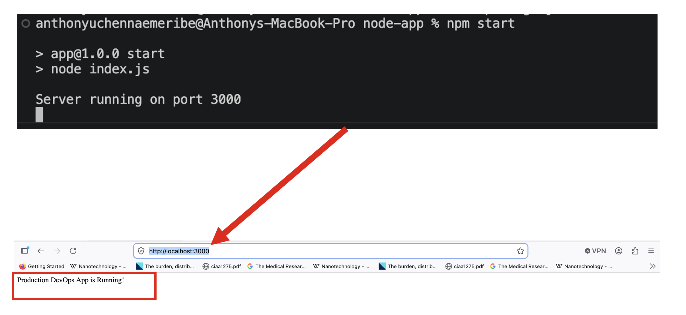
---

# PHASE 2 — PUSH APPLICATION TO GITHUB

---

## Step 7 — Create .gitignore

1. Create .gitignore using text editor:

```bash
nano .gitignore
```

Add:

```gitignore
node_modules/
.env
.DS_Store
npm-debug.log
coverage/
dist/
```
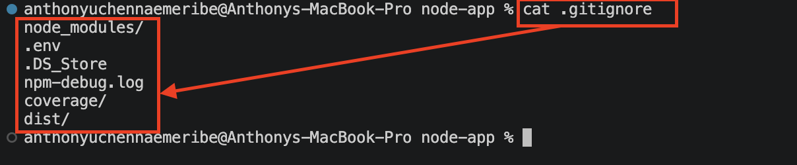
---

## Step 8 — Login to git and Initialize Git Repository

```bash
gh auth login
git init
git add .
git commit -m "Initial Node.js application"
```
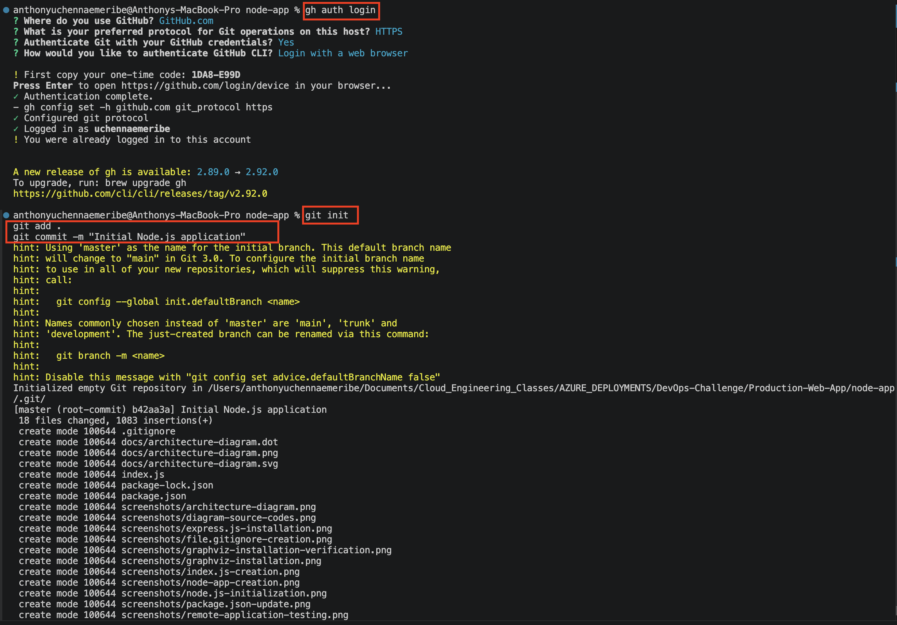
---

## Step 9 — Change branch name for your git

```bash
git branch -M main

```


---

## Step 10 — Create GitHub Repository and Push Code to GitHub
1. Create GitHub Repository
```bash
gh repo create node-app --public --source=. --remote=origin --push
```
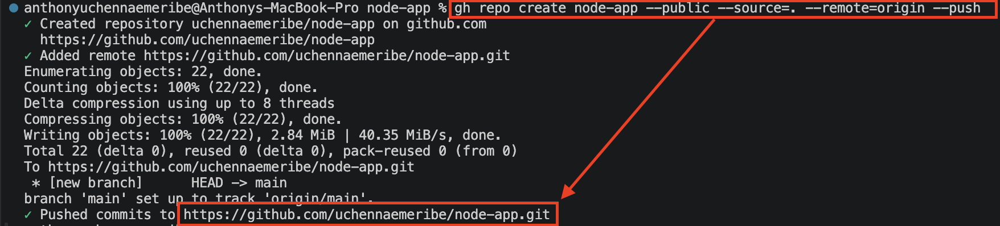

2. Verify configured repo

```bash
git remote -v
```
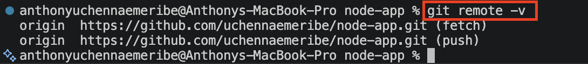

# PHASE 3 — CREATE AZURE VM USING AZURE CLI


## Step 11 — Login to Azure

```bash
az login
```

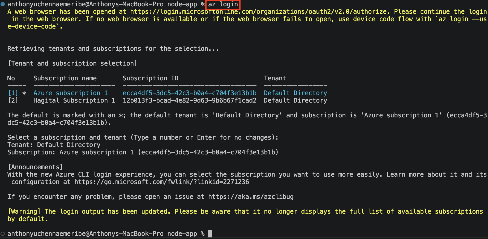
---

## Step 12 — Create Resource Group

```bash
az group create --name nodeRG --location westus
```
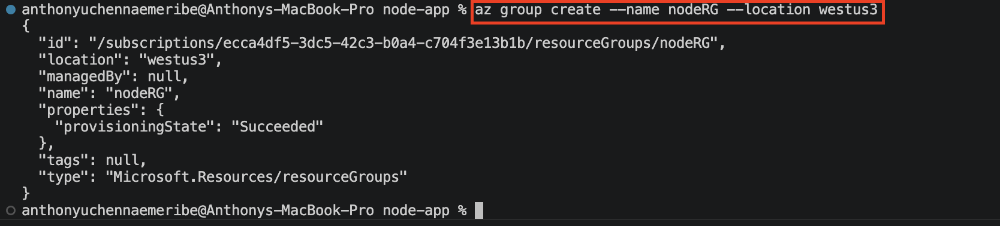
---

## Step 13 — Create Azure Virtual Machine

1. Run:
```bash
az vm create --resource-group nodeRG --name node-app-vm --image Ubuntu2204 --admin-username azureuser --generate-ssh-keys --size Standard_B1s
```
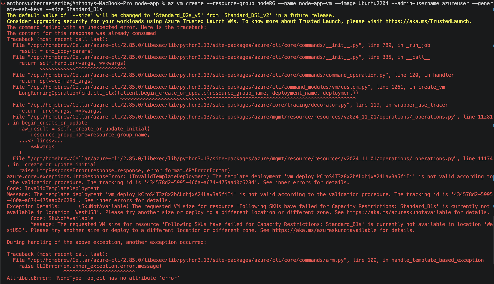

2. Troubleshoot using:

```bash
az vm create --resource-group nodeRG --name node-app-vm --image Ubuntu2204 --admin-username azureuser --generate-ssh-keys --size Standard_D2s_v3
```
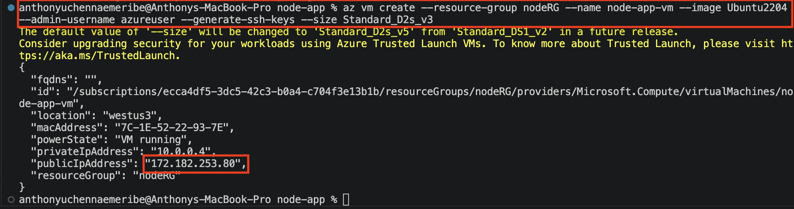

Azure returns:
- public IP
- VM details

Save the public IP.

---

## Step 14 — Open Required Ports

### Open SSH Port

```bash
az vm open-port --resource-group nodeRG --name node-app-vm --port 22
```
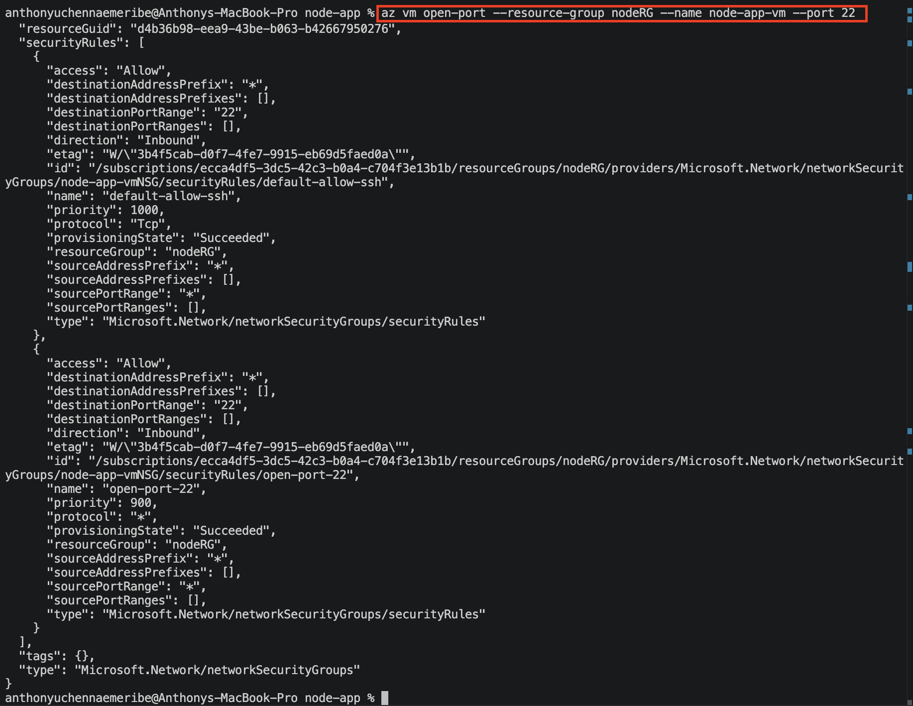

### Open HTTP Port by Creating Network Security Group Rule for port 80
```bash
az network nsg rule create --resource-group nodeRG --nsg-name node-app-vmNSG --name allow-http --priority 1010 --destination-port-ranges 80 --access Allow --protocol Tcp
```
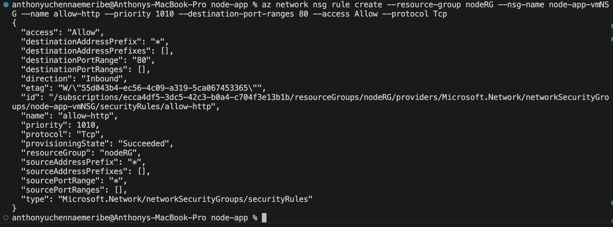


### Open HTTPS Port

```bash
az network nsg rule create --resource-group nodeRG --nsg-name node-app-vmNSG --name allow-https --priority 1020 --destination-port-ranges 443 --access Allow --protocol Tcp
```
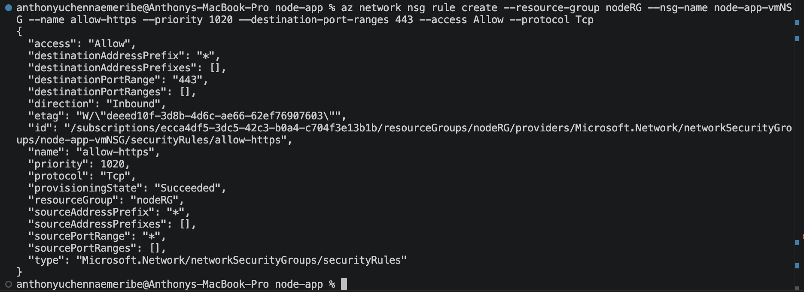
---

## Step 15 — Get VM Public IP

```bash
az vm show --resource-group nodeRG --name node-app-vm -d --query publicIps -o tsv
```
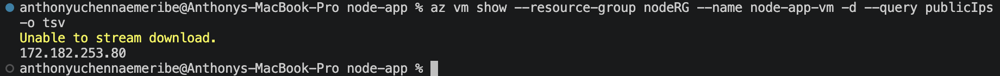
---

# PHASE 4 — CONNECT TO VM

---

## Step 16 — SSH Into Azure VM

```bash
ssh azureuser@172.182.253.80
```

Example:

```bash
ssh azureuser@172.182.253.80
```
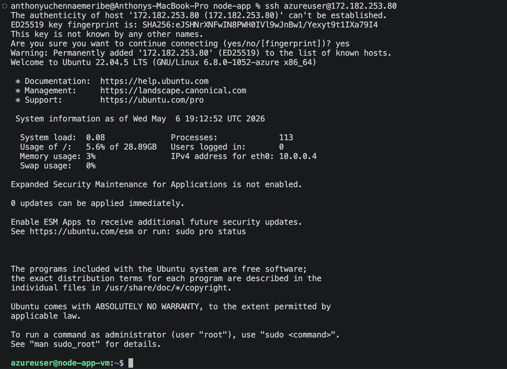
---

# PHASE 5 — CONFIGURE SERVER

---

## Step 17 — Update Ubuntu Packages

```bash
sudo apt update
sudo apt upgrade -y
```
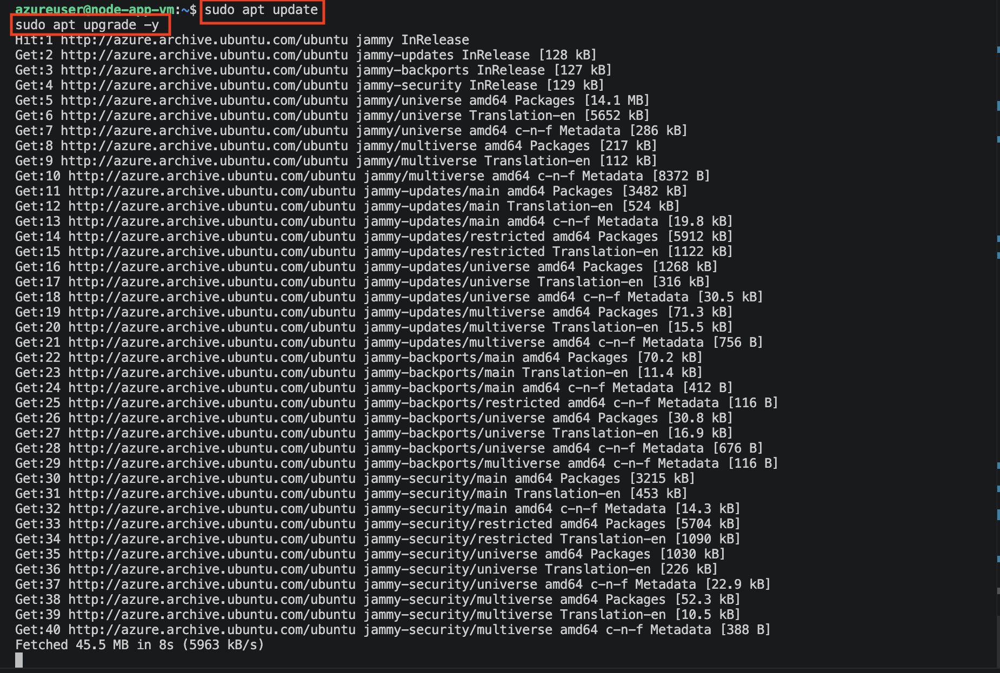
---

## Step 18 — Install Node.js

1. Install pre-requisites for Node.js v20 using:

```bash
curl -fsSL https://deb.nodesource.com/setup_20.x | sudo -E bash -
```
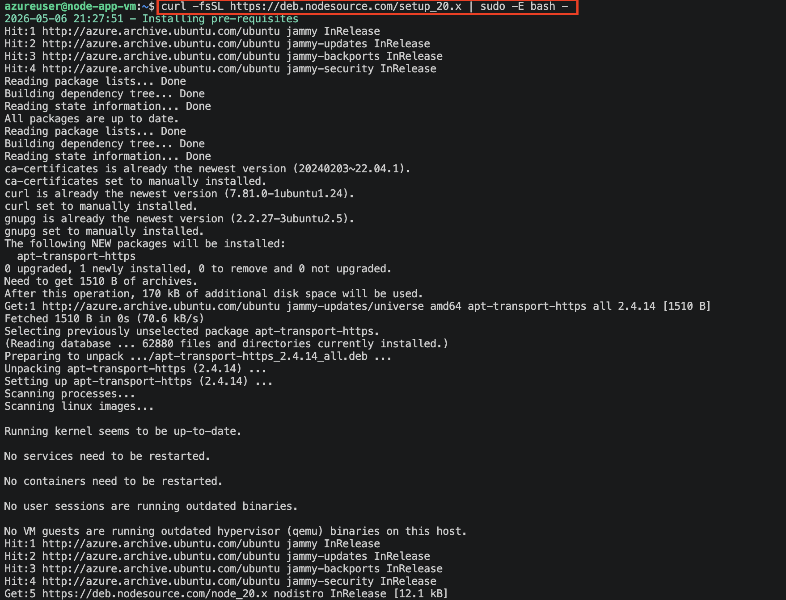

2. Then install Node.js v20 using:

```bash
sudo apt install -y nodejs
```
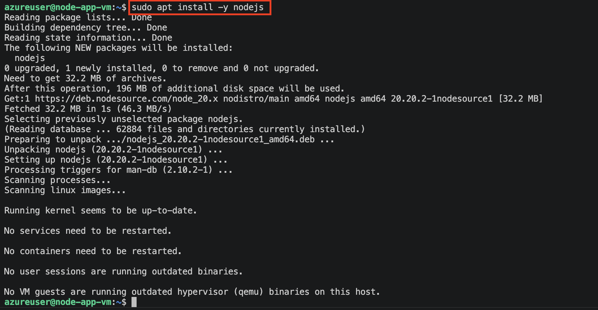

3. Verify installation:

```bash
node -v
npm -v
```
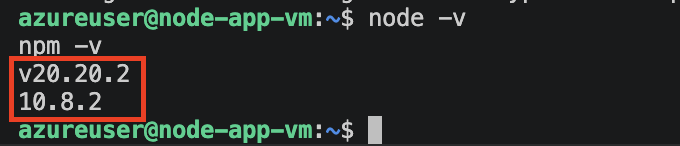
---

## Step 19 — Install Nginx
1. Run
```bash
sudo apt install nginx -y
```
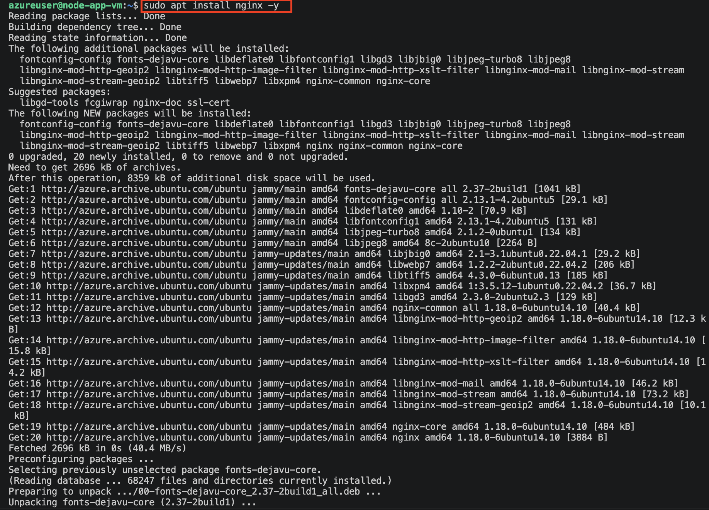

2. Enable and start Nginx:

```bash
sudo systemctl enable nginx
sudo systemctl start nginx
```
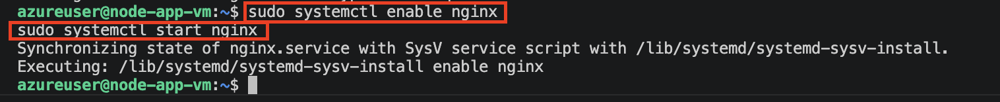
---
3. Upgrade npm packages and verify installation using:
```bash
sudo npm install -g npm@11.14.0
npm -v
```
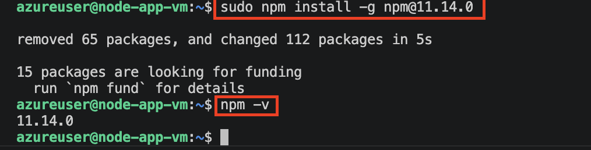

## Step 20 — Install PM2
1. Run
```bash
sudo npm install -g pm2
```
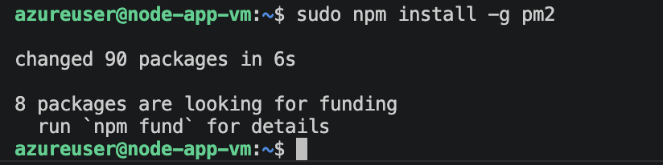

2. Verify PM2 Installation:

```bash
pm2 -v
```

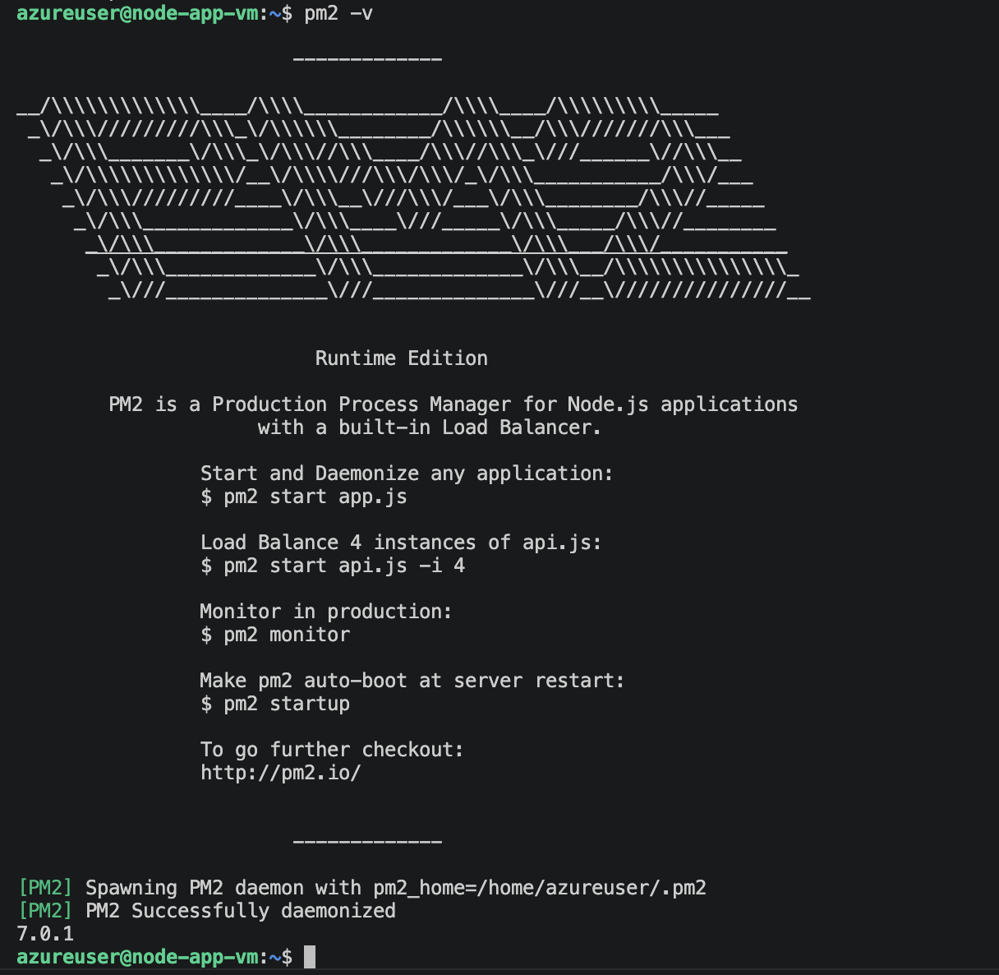
---

# PHASE 6 — DEPLOY APPLICATION

---

## Step 21 — Clone Repository
1. Run:
```bash
git clone https://github.com/uchennaemeribe/node-app.git
```
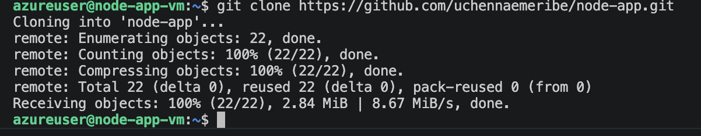

2. Move into project:

```bash
cd node-app
```
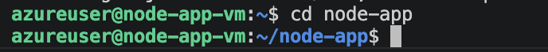
---

## Step 22 — Install Dependencies

```bash
npm install
```
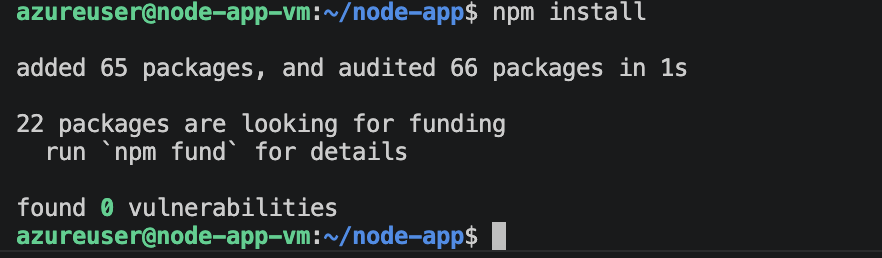
---

## Step 23 — Start Application with PM2
1. Run:
```bash
pm2 start index.js --name my-app
```
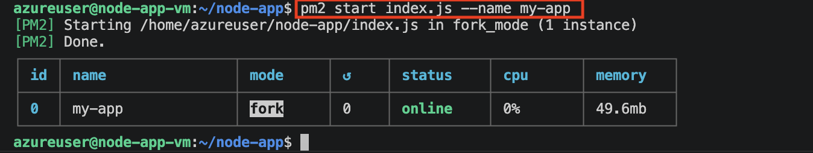

2. Save PM2:

```bash
pm2 save
```


3. Enable startup:

```bash
pm2 startup
```
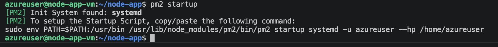

Run the generated command.

---

## Step 24 — Verify PM2 Status

```bash
pm2 status
```
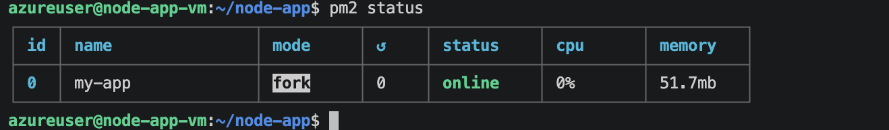
---

# PHASE 7 — CONFIGURE NGINX

---

## Step 25 — Configure Reverse Proxy
1. Run:
```bash
sudo nano /etc/nginx/sites-available/default
```

2. Replace entire content with:

```nginx
server {
    listen 80;

    location / {
        proxy_pass http://localhost:3000;
    }
}
```

Save:
- CTRL + X
- Y
- ENTER

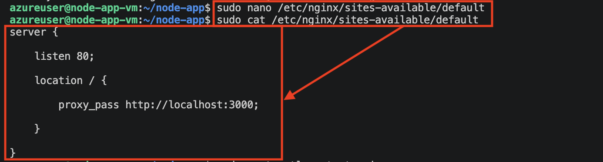
---

## Step 26 — Restart Nginx

```bash
sudo systemctl restart nginx
```
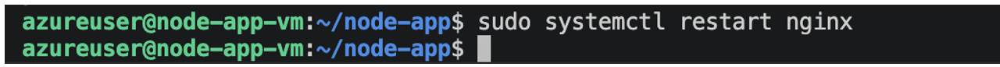

Test:

```text
http://172.182.253.80
```
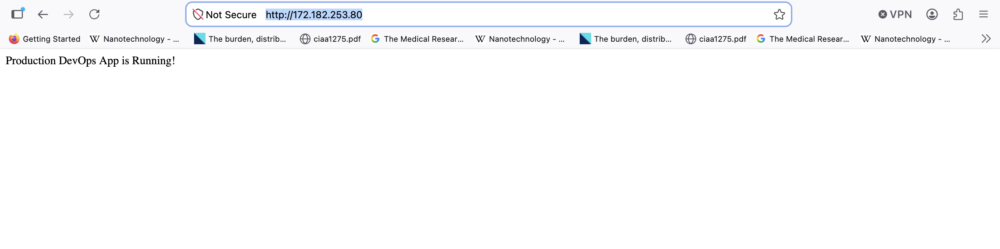
---
Exit the VM and proceed to your project directory (node-app) to execute phase 8.

# PHASE 8 — CONFIGURE CI/CD

---

## Step 27 — Add GitHub Secrets Using GitHub CLI

Instead of manually adding secrets from the GitHub UI, use GitHub CLI (`gh`) directly from your terminal.

This approach is:
- Faster
- More secure
- Professional
- Fully CLI-driven

---

1. Verify GitHub CLI Authentication

Check:

```bash
gh auth status
```

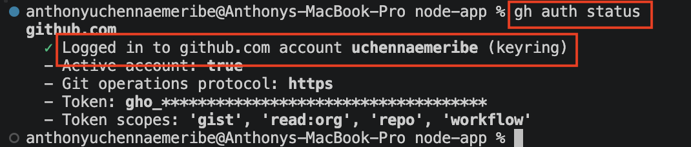

If not authenticated:

```bash
gh auth login
```

---

2. Verify Repository Connection

Run:

```bash
git remote -v
```
You should see your GitHub repository URL.

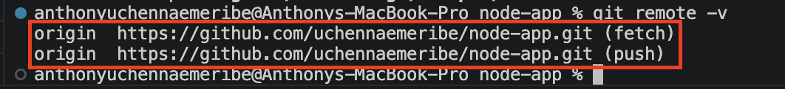
---

3. Add VM Public IP Secret

Run:

```bash
gh secret set VM_IP --body "172.182.253.80"
```

Replace with your actual Azure VM static public IP if different.

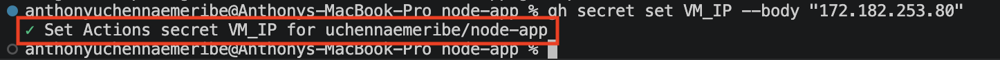
---

4. Add VM Username Secret

Run:

```bash
gh secret set VM_USER --body "azureuser"
```

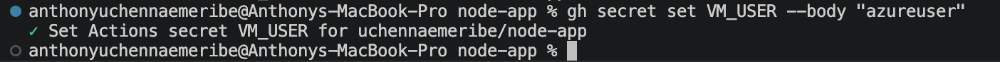
---

5. Generate SSH Key Pair (If Needed)

If you do not already have SSH keys:

```bash
ssh-keygen -t rsa -b 4096 -C "azure-vm-key"
```

Press `Enter` through prompts.

This creates:

```text
~/.ssh/id_rsa
~/.ssh/id_rsa.pub
```
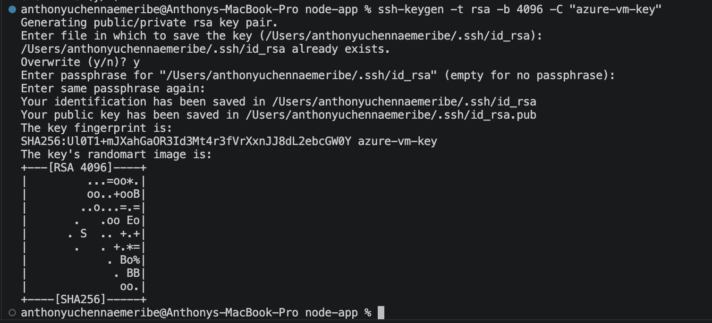
---

6. Upload SSH Private Key to GitHub Secrets

Run:

```bash
gh secret set SSH_PRIVATE_KEY < ~/.ssh/cicd-key.pem
```
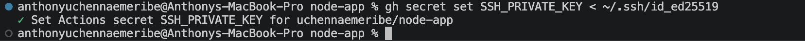

If your key file is elsewhere:

```bash
gh secret set SSH_PRIVATE_KEY < ~/Downloads/node-app-vm_key.pem
```

Replace with your actual private key path.

---

7. Verify GitHub Secrets

Run:

```bash
gh secret list
```

Expected output:

```text
VM_IP
VM_USER
SSH_PRIVATE_KEY
```

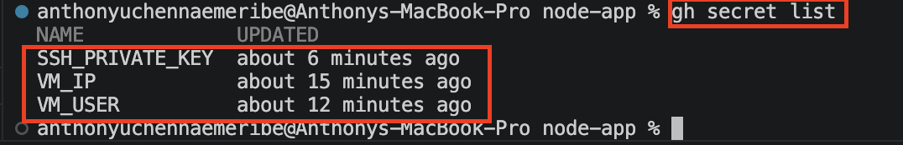
---

## Step 28 — Create GitHub Actions Workflow

1. Create:

```bash
mkdir -p .github/workflows

touch .github/workflows/deploy.yml
```

2. Add:

```yaml
name: Deploy to Azure VM

on:
  push:
    branches:
      - main

jobs:

  deploy:
    name: Deploy Application
    runs-on: ubuntu-latest

    steps:

      - name: Deploy via SSH
        uses: appleboy/ssh-action@v1.0.3

        with:
          host: ${{ secrets.VM_IP }}
          username: ${{ secrets.VM_USER }}
          key: ${{ secrets.SSH_PRIVATE_KEY }}

          script: |
            cd node-app
            git pull origin main
            npm install
            pm2 restart my-app
```

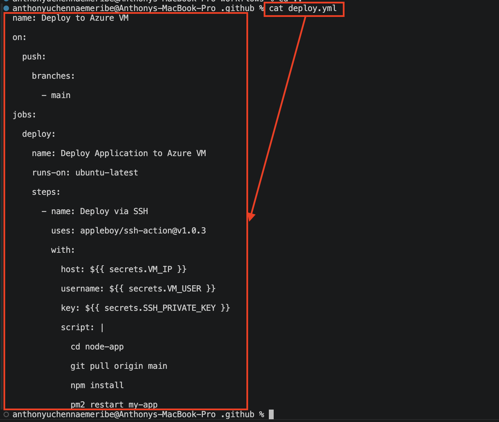
---

## Step 29 — Push Workflow to GitHub

```bash
git add .
git commit -m "Add CI/CD workflow"
git push origin main
```
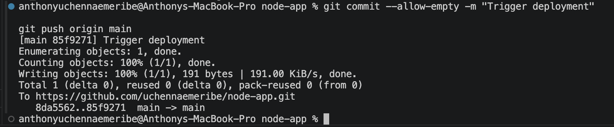
---

## Step 30 — Verify GitHub Actions

Go to:

```text
GitHub Repository → Actions
```

The workflow should run automatically.

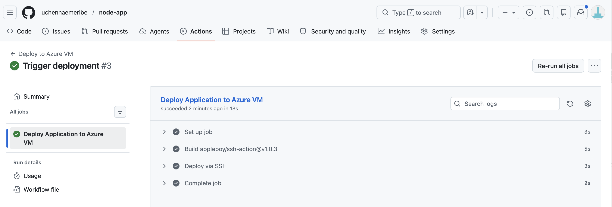
---

# PHASE 9 — CONFIGURE AZURE DNS

---

## Step 31 — Create Azure DNS Zone

```bash
az network dns zone create --resource-group nodeRG --name auemeribetech.com.ng
```
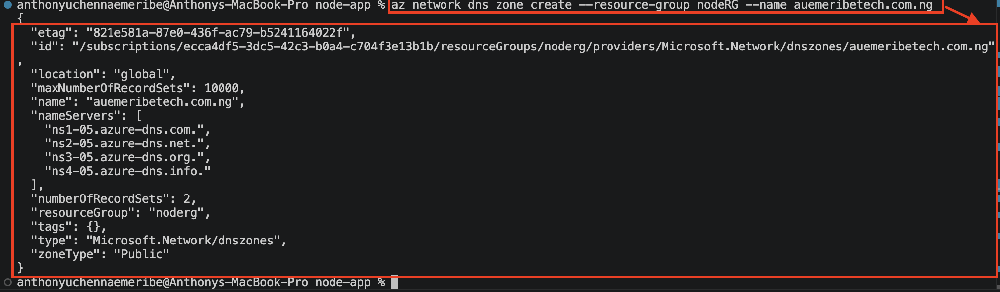
---

## Step 32 — Get Azure Nameservers

```bash
az network dns zone show --resource-group nodeRG --name auemeribetech.com.ng --query nameServers
```
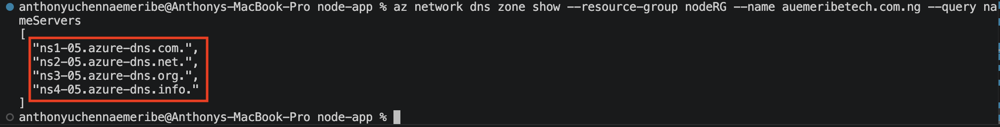
Copy the nameservers.

---

## Step 33 — Update Nameservers at Domain Registrar

1. Go to:
- QServers
- Namecheap
- GoDaddy

Replace existing nameservers with Azure nameservers.

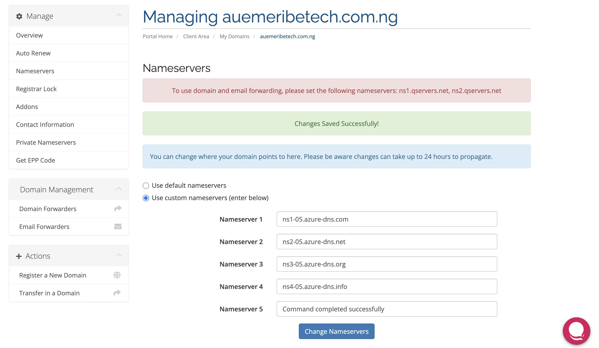

2. Wait for propagation

3. After approximately 10–15 minutes, verify that the domain is now using Azure DNS nameservers.

Run:

```bash
dig auemeribetech.com.ng NS
```
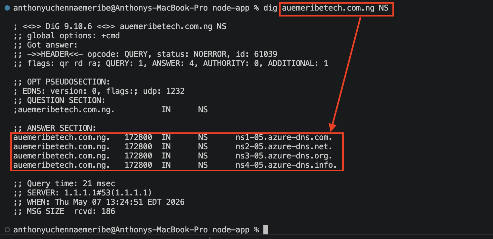
---

## Step 34 — Create Root Domain A Record

```bash
az network dns record-set a add-record --resource-group nodeRG --zone-name auemeribetech.com.ng --record-set-name @ --ipv4-address 172.182.253.80
```
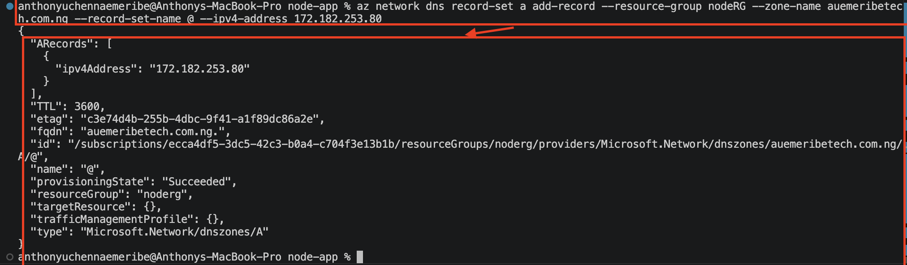
---

## Step 35 — Create WWW Record

```bash
az network dns record-set a add-record --resource-group nodeRG --zone-name auemeribetech.com.ng --record-set-name www --ipv4-address 172.182.253.80
```
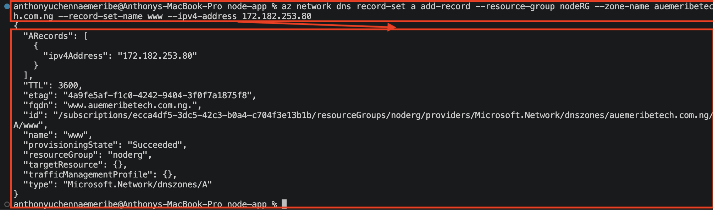
---

# PHASE 10 — CONFIGURE DOMAIN IN NGINX

---

## Step 36 — Update Nginx Configuration

1. Access the Azure VM
```bash
ssh azureuser@172.182.253.80
```
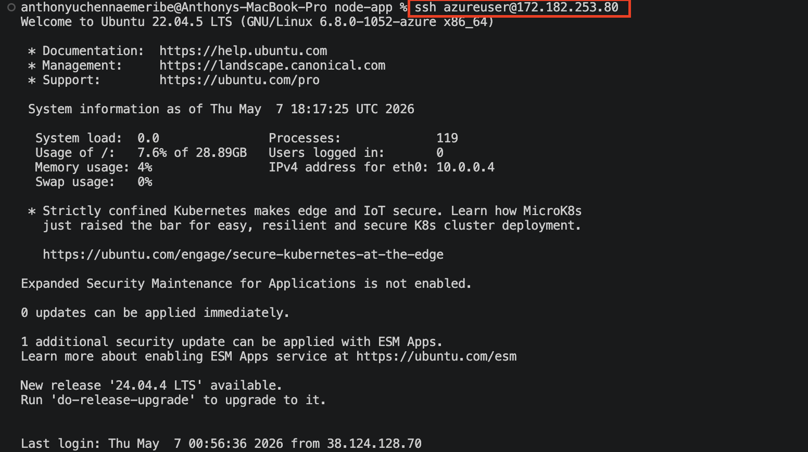

2. Open Nginx
```bash
sudo nano /etc/nginx/sites-available/default
```

3. Replace Nginx content with:

```nginx
server {
    listen 80;

    server_name auemeribetech.com.ng www.auemeribetech.com.ng;

    location / {
        proxy_pass http://localhost:3000;
    }
}
```
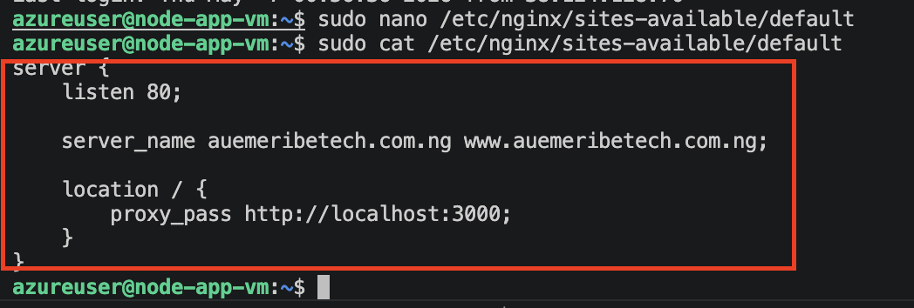

3. Restart Nginx:

```bash
sudo systemctl restart nginx
```
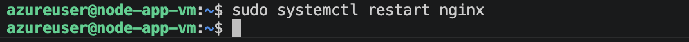

4. Test:

```text
http://www.auemeribetech.com.ng
```
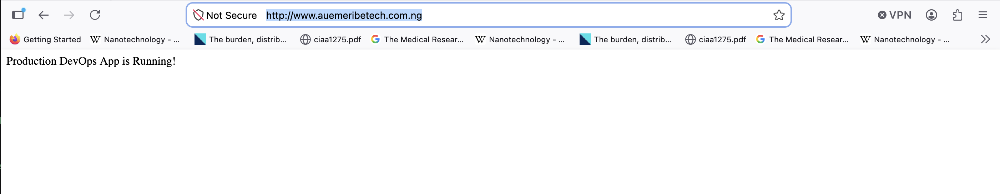
---

# PHASE 11 — ENABLE HTTPS

---

## Step 37 — Install Certbot

```bash
sudo apt install certbot python3-certbot-nginx -y
```
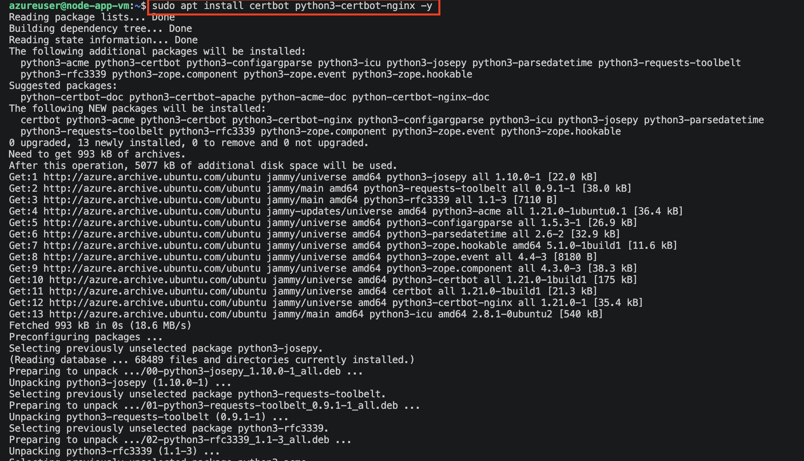
---

## Step 38 — Configure SSL Certificate

```bash
sudo certbot --nginx
```

Choose:
- auemeribetech.com.ng
- www.auemeribetech.com.ng
- redirect HTTP to HTTPS

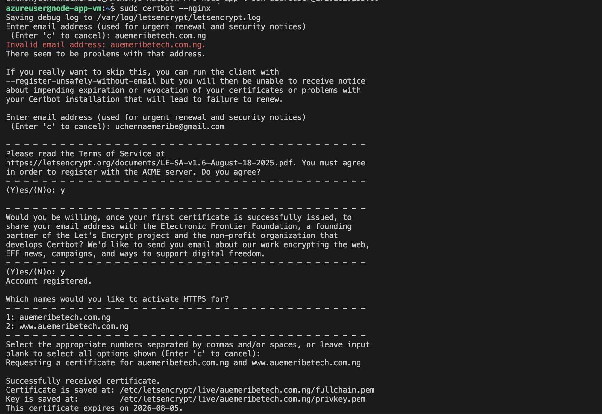
---

## Step 39 — Verify HTTPS

Visit:

```text
https://www.auemeribetech.com.ng
```

The application should now be secured with HTTPS.

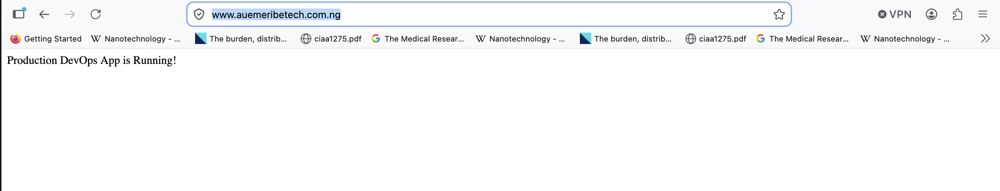
---

# PHASE 12 — TEST FULL CI/CD PIPELINE

---

## Step 40 — Modify Application

Edit:

```text
index.js
```

Update:

```javascript
res.send('Production Deployment Successful!');
```

---

## Step 41 — Push Changes

```bash
git add .
git commit -m "Test automated deployment"
git push origin main
```

GitHub Actions automatically:
- connects to VM
- pulls latest code
- installs dependencies
- restarts PM2

Refresh:

```text
https://www.auemeribetech.com.ng
```

---

# Common Errors and Fixes

## package.json Not Found

Fix:

```bash
pwd
ls
cd node-app
```

---

## 502 Bad Gateway

Fix:

```bash
pm2 status
pm2 restart my-app
```

---

## HTTPS Certbot Failure

Fix:
- verify Azure DNS nameservers
- verify DNS records
- wait for propagation

---

## GitHub Actions Failure

Fix:
- verify SSH key
- verify VM IP
- test SSH manually

---

# Final Outcome

You successfully built:

- Azure VM Infrastructure
- Automated CI/CD Pipeline
- Azure DNS Integration
- Production Node.js Deployment
- HTTPS Secure Application
- Reverse Proxy Architecture
- GitHub Actions Automation

---

# Cleanup Resources

```bash
az group delete \
  --name nodeRG \
  --yes \
  --no-wait
```

---

# Author

Anthony Uchenna Emeribe

Cloud / DevOps Engineer
